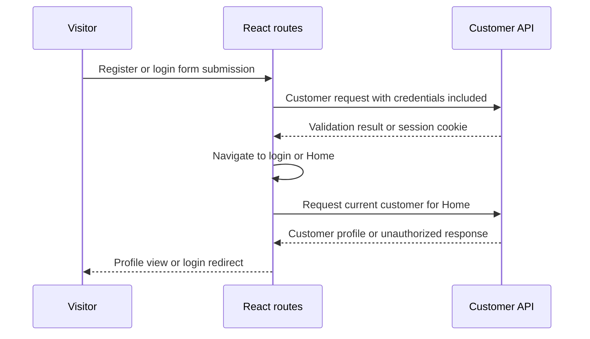

# ShopKart Authentication Flow - Plan

## Goal Capsule

- **Objective:** Customers can create an account, sign in, see their own profile on ShopKart Home, and sign out.
- **Means:** Build a small React application that uses the existing customer API and its HttpOnly cookie session (KTD1, KTD2).
- **Authority:** The supplied Frontend Engineering Lab specification controls product behavior. Existing backend route and response behavior controls API integration.
- **Stop conditions:** The `/register`, `/login`, and protected `/home` routes meet the specified flows, and logout returns the customer to login.

---

## Product Contract

### Summary

This plan creates the ShopKart prototype authentication flow for customer registration, login, protected profile display, and logout.
It keeps the work to React, React Router, Fetch API, and CSS, with the minimal backend cross-origin configuration required for cookie-based API calls.

### Problem Frame

The backend can register and authenticate customers but has no customer-facing interface.
Customers need a simple route-based flow to create an account, authenticate through the existing HttpOnly cookie, and view their current profile without client-side token storage.

### Requirements

**Registration**

- R1. `/register` shows controlled inputs for full name, email, password, and phone number.
- R2. `/register` validates required values and the six-character password minimum before it calls the API.
- R3. `/register` posts the specified customer payload to `/customers/register`, shows API validation failures, and redirects to `/login` after successful registration.

**Login and session**

- R4. `/login` shows controlled email and password inputs and posts them to `/customers/login` with browser credentials enabled.
- R5. `/login` shows `Invalid Credentials` when authentication fails and navigates to `/home` when it succeeds.
- R6. The client does not read, store, or display the HttpOnly token.

**Protected home and logout**

- R7. `/home` loads the current customer from `/customers/me` with browser credentials enabled.
- R8. `/home` displays a welcome message with the customer's full name, email, and phone number after the profile loads.
- R9. An unauthenticated or failed `/customers/me` response redirects the customer to `/login`.
- R10. The navbar exposes Logout, posts to `/customers/logout` with browser credentials enabled, and redirects to `/login` after completion.

**Routing and presentation**

- R11. React Router maps `/register`, `/login`, and `/home`, with sensible navigation between registration and login.
- R12. The three pages use a clean, responsive layout without adding Redux, a hosted auth provider, or unrelated shop features.

### Actors

- A1. Visitor who needs to register or log in.
- A2. Authenticated customer who views their ShopKart profile and logs out.
- A3. Existing ShopKart backend that owns credentials, cookies, and customer identity.

### Key Flows

- F1. Registration
  - **Trigger:** A visitor submits the registration form.
  - **Actors:** A1, A3.
  - **Steps:** The form validates inputs, sends customer details, surfaces a failure when returned, or navigates to login after account creation.
  - **Outcome:** A new customer can continue to login.
- F2. Login to Home
  - **Trigger:** A registered visitor submits valid credentials.
  - **Actors:** A1, A3.
  - **Steps:** The browser includes credentials in the login request, accepts the backend's HttpOnly cookie, then Home requests the current customer.
  - **Outcome:** The customer sees their profile information.
- F3. Protected visit and logout
  - **Trigger:** A customer opens Home or chooses Logout.
  - **Actors:** A2, A3.
  - **Steps:** Home verifies the session through `/customers/me`; an invalid session returns to login; logout clears the backend cookie and returns to login.
  - **Outcome:** Profile access is restricted to an active customer session.

### Acceptance Examples

- AE1. Given blank registration fields, when the visitor submits, then field validation is shown and no registration request is sent.
- AE2. Given a duplicate email or a short password, when registration fails, then the backend message is visible and the visitor stays on `/register`.
- AE3. Given invalid login credentials, when the visitor submits, then `Invalid Credentials` is visible and the visitor stays on `/login`.
- AE4. Given a valid customer session, when Home loads, then the welcome message, name, email, and phone number are visible.
- AE5. Given no valid customer session, when Home loads, then the visitor is redirected to `/login`.
- AE6. Given an authenticated customer, when Logout is selected, then the cookie is cleared by the backend and the customer is redirected to `/login`.

### Scope Boundaries

- This plan covers only the requested authentication-to-Home prototype.
- It does not add product browsing, cart, checkout, password reset, email verification, role management, Redux, or third-party authentication.
- It does not expand the backend authentication design beyond the CORS prerequisite for a separately served local React app.

### Dependencies

- The backend remains available at the configured API origin and MongoDB is configured.
- The frontend development origin is known so the backend can allow credentialed browser requests from it.

---

## Planning Contract

### Key Technical Decisions

- KTD1. **Create a small React client in `frontend/` with React Router and Fetch API.** No frontend project exists in the repository, and this structure exactly matches the requested lab layout while avoiding extra state or authentication libraries.
- KTD2. **Use one API helper that always sends `credentials: "include"` for customer endpoints.** The backend sets an HttpOnly `token` cookie, so browser-managed credentials establish and verify the session; the client should only request `/customers/me` for identity.
- KTD3. **Add a minimal credentialed CORS configuration to the existing Express app for the local React origin.** The current backend has no CORS middleware, which prevents a separately served frontend from reading credentialed responses; configure one explicit frontend origin rather than a wildcard.
- KTD4. **Protect Home by resolving `/customers/me` when the page mounts.** This keeps server session state authoritative and redirects on any failed identity check instead of trusting client memory.
- KTD5. **Use component state for forms, request status, field errors, and profile data.** This is enough for the single-page prototype and meets the controlled-component requirement without Redux.
- KTD6. **Use a lightweight React test harness only for the planned component and service tests.** It verifies the stated flows without adding application state, authentication, or UI dependencies.

### High-Level Technical Design

### Sequencing

Complete the client scaffold and API seam first.
Then implement the registration and login pages, followed by protected Home and logout because both depend on the shared session helper.

### Deferred Implementation Notes

- Confirm the final local frontend origin and API port from the developer's runtime setup before assigning the CORS origin.
- Use the backend's returned message for registration errors. Preserve `Invalid Credentials` as the login failure message required by the lab.

---

## Implementation Units

### U1. Scaffold the React client and credentialed API seam

- **Goal:** Create the requested React application structure and make the existing customer endpoints reachable from one configured service layer.
- **Requirements:** R4, R6, R7, R10, R11, R12.
- **Dependencies:** None.
- **Files:** `frontend/package.json`, `frontend/src/main.jsx`, `frontend/src/App.jsx`, `frontend/src/services/api.js`, `frontend/src/index.css`, `frontend/vite.config.js`, `frontend/src/services/api.test.js`, `backend/package.json`, `backend/index.js`.
- **Approach:** Create the frontend under `frontend/`. Configure the requested routes in the application shell. Put the API base origin, response-error handling, and credentialed Fetch behavior in one service module. Configure a lightweight test runner for the named service and page tests. Add the smallest Express CORS setup that permits the one configured local frontend origin and credentials before the customer routes.
- **Patterns to follow:** `backend/index.js` registers process-wide Express middleware before `customerRoutes`; `routes/customer.routes.js` is the source of truth for endpoint paths.
- **Test scenarios:**
  - The API helper sends registration data to the customer registration endpoint.
  - The API helper sends credentials for login, current-profile, and logout requests.
  - A failed API response makes the backend message available to the calling page.
  - The app renders route targets for register, login, and Home.
- **Verification:** The frontend starts and requests can reach the backend from the configured browser origin without a CORS failure.

### U2. Implement the registration page

- **Goal:** Let a visitor create an account and continue to login.
- **Requirements:** R1, R2, R3, R11, R12; F1; AE1, AE2.
- **Dependencies:** U1.
- **Files:** `frontend/src/pages/Register.jsx`, `frontend/src/pages/Register.test.jsx`, `frontend/src/index.css`.
- **Approach:** Keep all four input values in page state. Validate required fields and password length before calling the shared API service. Disable repeated submission while the request is pending. Show field-level validation and the backend failure message. Navigate only after a successful response.
- **Patterns to follow:** The registration payload must use `fullName`, `email`, `password`, and `phone`, matching `controllers/customer.controller.js`.
- **Test scenarios:**
  - Covers AE1. Submitting empty values shows required validation and does not invoke registration.
  - A password shorter than six characters shows validation and does not invoke registration.
  - Covers AE2. A rejected registration response shows its message and preserves the form values.
  - A successful registration posts the exact four customer fields and navigates to login.
  - The login navigation link sends a visitor to `/login`.
- **Verification:** A new customer can register from the browser and lands on login; invalid entries remain understandable on small and large screens.

### U3. Implement the login page

- **Goal:** Authenticate a customer through the backend cookie session and take them to Home.
- **Requirements:** R4, R5, R6, R11, R12; F2; AE3.
- **Dependencies:** U1.
- **Files:** `frontend/src/pages/Login.jsx`, `frontend/src/pages/Login.test.jsx`, `frontend/src/index.css`.
- **Approach:** Keep email and password controlled in local state. Use the shared credentialed login request. Render the required invalid-credentials feedback for any failed authentication. Do not inspect or persist a token. Navigate to Home only on success.
- **Patterns to follow:** `loginCustomer` returns a success message but no customer object, so Home must obtain identity through the profile endpoint.
- **Test scenarios:**
  - Submitting empty email or password shows validation and skips the API call.
  - Covers AE3. A rejected login response shows `Invalid Credentials` and stays on login.
  - A successful login calls the shared API service and navigates to Home.
  - The registration navigation link sends a visitor to `/register`.
- **Verification:** Valid backend credentials result in Home navigation with no client-side token storage.

### U4. Implement protected Home, navbar logout, and profile states

- **Goal:** Resolve the active customer from the backend, present their profile, and end their session on logout.
- **Requirements:** R7, R8, R9, R10, R12; F3; AE4, AE5, AE6.
- **Dependencies:** U1, U3.
- **Files:** `frontend/src/pages/Home.jsx`, `frontend/src/pages/Home.test.jsx`, `frontend/src/components/Navbar.jsx`, `frontend/src/components/Navbar.test.jsx`, `frontend/src/index.css`.
- **Approach:** Load the current customer when Home opens. Render a short loading state before the profile resolves. Redirect to login on failed profile retrieval. Render Navbar only for the authenticated Home view. Invoke the shared logout request from Navbar and navigate to login when it completes.
- **Patterns to follow:** `getMyProfile` returns `_id`, `fullName`, `email`, and `phone`; `logoutCustomer` requires the same authenticated cookie as Home.
- **Test scenarios:**
  - Covers AE4. A successful profile response renders the welcome message, full name, email, and phone number.
  - Covers AE5. A failed profile request redirects to login and does not render profile details.
  - Home shows a pending state while the profile request has not resolved.
  - Covers AE6. Selecting Logout calls the credentialed logout service and navigates to login after success.
- **Verification:** Direct navigation to `/home` works only with a valid session, and logout prevents the next protected visit from showing the profile.

---

## Verification Contract

| Scope | Proof |
| --- | --- |
| React UI units | Run the frontend unit tests for the API service, Register, Login, Home, and Navbar after configuring the chosen React test runner. |
| Browser registration flow | Submit empty, short-password, duplicate-email, and valid customer data; confirm errors and login redirect. |
| Browser login flow | Test invalid and valid credentials; confirm the required failure message and Home navigation. |
| Protected route | Open `/home` without a session and with a session; confirm redirect versus profile display. |
| Logout flow | Log out, then revisit `/home`; confirm that Home redirects to login. |
| Integration prerequisite | Verify that browser developer tools show credentialed customer requests and no CORS error between the configured frontend and backend origins. |

---

## Definition of Done

- U1 through U4 meet their listed verification outcomes.
- The three required routes work from direct navigation and in-app links.
- Registration uses controlled fields and gives clear validation/API feedback.
- Login sends browser credentials and never stores the HttpOnly token in JavaScript-accessible state.
- Home displays only the current customer returned by `/customers/me` and redirects when unauthenticated.
- Navbar logout clears the backend session through `/customers/logout` and returns the user to login.
- The UI remains readable and usable at narrow and desktop viewport widths.
- No unrelated e-commerce, identity-provider, Redux, or advanced-security work is included.

---

## Risks & Dependencies

- **Credentialed cross-origin requests:** The backend currently has no CORS middleware. Add the configured frontend origin and `credentials: true`; wildcard origins cannot support credentialed browser responses. The Fetch credential mode controls both outgoing cookies and whether a `Set-Cookie` response is respected.
- **Cookie delivery in local development:** Frontend and backend ports must remain consistent with the configured CORS origin. A changed port requires updating the allowed origin.
- **Missing frontend baseline:** This repository currently contains only the Node/Express backend. The plan assumes a new Vite-based React client and a small component-test setup are appropriate for the lab's required structure.

---

## Sources & Research

- `backend/controllers/customer.controller.js` defines the registration payload, validation messages, login cookie, profile shape, and logout behavior.
- `backend/routes/customer.routes.js` defines the four customer endpoint paths.
- `backend/index.js` shows that CORS middleware is not currently configured.
- [MDN: Request credentials](https://developer.mozilla.org/en-US/docs/Web/API/Request/credentials) documents that credential mode determines whether browser credentials are sent and whether `Set-Cookie` is respected.
- [Express CORS middleware documentation](https://expressjs.com/en/resources/middleware/cors/) documents explicit credentialed-origin configuration.
