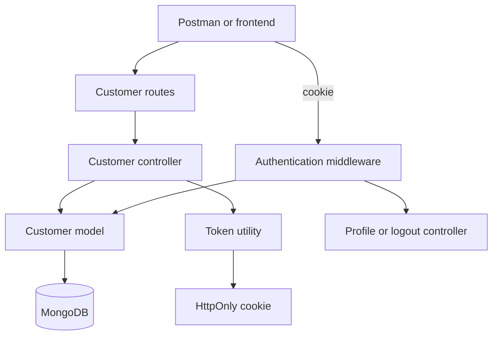

# Customer Authentication - Plan

## Goal Capsule

- **Objective:** Customers can create an account, sign in, view only their own profile, and sign out through the ShopKart backend.
- **Means:** Use the required Express, MongoDB, Mongoose, bcrypt, jsonwebtoken, and cookie-parser stack with JWT cookie authentication. (KTD1, KTD2)
- **Authority:** The lab brief is the source of truth. Implement only Tasks 1–4.
- **Stop conditions:** All four listed endpoints meet their request, response, protection, and error-handling requirements. No API response exposes a password.

---

## Product Contract

### Summary

Add a small customer authentication API under `/customers`.
It will persist customer details in MongoDB, authenticate passwords with bcrypt, and keep the signed JWT in an HttpOnly cookie.

### Problem Frame

The ShopKart frontend has no backend identity service.
Customers therefore cannot register, log in, access an authenticated profile, or end their session.

### Requirements

**Registration**

- R1. `POST /customers/register` accepts `fullName`, `email`, `password`, and `phone` and rejects any missing field with a 400 response.
- R2. Registration rejects passwords shorter than six characters with a 400 response.
- R3. Registration rejects an existing email with a 409 response.
- R4. A new customer stores the password only as a bcrypt hash and returns the required password-free customer response.

**Authentication**

- R5. `POST /customers/login` verifies the submitted email and password and returns one 401 invalid-credentials response for either failure.
- R6. A successful login creates a JWT and sends it only in an HttpOnly authentication cookie.
- R7. `GET /customers/me` accepts only a valid cookie JWT, finds the associated customer, attaches it to `req.user`, and returns the password-free profile response.
- R8. A missing, invalid, expired, or orphaned JWT returns 401 Unauthorized.
- R9. `POST /customers/logout` requires authentication, clears the same authentication cookie, and returns the required success response.

### Key Flows

- F1. **Register a customer**
  - **Trigger:** An unauthenticated customer submits all registration fields.
  - **Steps:** Validate input, reject duplicate email or short password, hash the password, save the customer, and return safe customer data.
  - **Outcome:** The customer account exists without exposing or storing a plaintext password.
- F2. **Log in and access profile**
  - **Trigger:** A registered customer submits valid credentials, then requests `/customers/me`.
  - **Steps:** Compare the bcrypt hash, set the HttpOnly JWT cookie, verify it in middleware, and load the customer.
  - **Outcome:** Only the authenticated customer receives their profile.
- F3. **Log out**
  - **Trigger:** An authenticated customer posts to `/customers/logout`.
  - **Steps:** Authentication succeeds, then the response clears the cookie using its original cookie identity.
  - **Outcome:** Later protected requests no longer have the authentication cookie.

### Acceptance Examples

- AE1. **New registration:** Given a unique email and a six-or-more-character password, registration returns success and safe customer fields; the database password is a bcrypt hash.
- AE2. **Duplicate registration:** Given an email already stored for a customer, registration returns 409 and does not create another account.
- AE3. **Invalid login:** Given an unknown email or a wrong password, login returns the same 401 response.
- AE4. **Protected profile:** Given no cookie or an invalid cookie, `/customers/me` returns 401; given the login cookie, it returns the matching customer without `password`.
- AE5. **Logout:** Given a valid login cookie, logout succeeds and the next request to `/customers/me` is unauthorized.

### Scope Boundaries

- Implement only customer registration, login, profile, logout, and the shared infrastructure required by these routes.
- Do not add the bonus change-password endpoint.
- Do not add authorization roles, password-reset flows, email verification, OAuth, rate limiting, Passport, or an authentication provider.

---

## Planning Contract

### Key Technical Decisions

- KTD1. **Hash at the Mongoose model boundary.** Use a pre-save hook to bcrypt-hash a new or modified password, and mark the password field unavailable by default in normal queries. This makes persistence safe even if a future controller saves a customer directly. Supports R4.
- KTD2. **Use a minimal, expiring JWT in one HttpOnly cookie.** The token payload contains only the customer identifier. `JWT_SECRET` and `JWT_EXPIRES_IN` come from environment variables. Use a single cookie name consistently when setting and clearing it. Supports R6, R7, R8, R9.
- KTD3. **Normalize expected authentication failures at the HTTP boundary.** Controllers return the lab's 400, 401, and 409 cases. The middleware returns 401 for every token failure and never exposes JWT-library details. Supports R1, R2, R3, R5, R8.
- KTD4. **Keep the server dependency-free beyond the lab list.** Read configuration from `process.env`; use Node's environment-file launch support when available rather than adding an unlisted runtime package. The package manifest contains only the permitted backend libraries. Supports R1–R9.

### High-Level Technical Design



The route layer maps HTTP endpoints to controllers.
The middleware is the single gate for protected endpoints and populates `req.user` only after token verification and customer lookup.

### Assumptions

- The API and frontend are served from the same site during this lab, so cross-origin cookie configuration is out of scope.
- The local Node runtime supports the selected environment-file launch method. If it does not, the TA or developer provides the listed variables through the process environment without adding a new package.
- The cookie uses `secure` only in production so local HTTP testing in Postman remains possible.

### Sequencing

Implement project setup and the model first, then register, then shared JWT middleware and login/profile/logout routes, then integration tests.

---

## Output Structure

```text
backend/
├── controllers/
│   └── customer.controller.js
├── middlewares/
│   └── auth.middleware.js
├── models/
│   └── customer.model.js
├── routes/
│   └── customer.routes.js
├── tests/
│   └── customer.auth.test.js
├── utils/
│   └── generateToken.js
├── .env
├── index.js
└── package.json
```

---

## Implementation Units

### U1. Bootstrap the ShopKart backend

- **Goal:** Create the prescribed backend entry point and install only the allowed runtime packages.
- **Requirements:** R1–R9.
- **Dependencies:** None.
- **Files:** `backend/package.json`, `backend/.env`, `backend/index.js`, `backend/tests/customer.auth.test.js`.
- **Approach:**
  1. Define scripts for starting the server and running Node's built-in test runner.
  2. Configure JSON parsing and `cookie-parser` before mounting customer routes.
  3. Connect Mongoose from `MONGO_URI` before accepting requests.
  4. Document placeholder values for `PORT`, `MONGO_URI`, `JWT_SECRET`, and `JWT_EXPIRES_IN` in `.env` without committing real secrets.
- **Test scenarios:**
  - Starting with a reachable MongoDB URI connects before the server accepts API requests.
  - JSON request bodies and cookies reach mounted customer routes.
  - Missing required environment variables fail clearly during startup instead of producing unsigned tokens.
- **Verification:** The application starts with a valid local `.env`, connects to MongoDB, and exposes the customer route prefix.

### U2. Model customers and register accounts

- **Goal:** Persist validated customers without plaintext passwords and serve the registration contract.
- **Requirements:** R1, R2, R3, R4.
- **Dependencies:** U1.
- **Files:** `backend/models/customer.model.js`, `backend/controllers/customer.controller.js`, `backend/routes/customer.routes.js`, `backend/tests/customer.auth.test.js`.
- **Approach:**
  1. Define `fullName`, `email`, `password`, `phone`, and automatic creation time in the Customer schema.
  2. Enforce required fields, unique email, password minimum length, and password hashing per KTD1.
  3. Add the registration controller and route, translating duplicate-key persistence failures into the required response per KTD3.
  4. Build registration responses from safe customer fields only.
- **Execution note:** Start with the registration integration cases so the database and response contract are proved together.
- **Test scenarios:**
  - Covers AE1. A unique, complete registration creates one customer, returns success, and omits `password`.
  - Covers AE1. Reading the saved customer with password explicitly selected shows a bcrypt hash that differs from the submitted password.
  - Covers AE2. Repeating the same email returns 409 and does not create a second customer.
  - An absent `fullName`, `email`, `password`, or `phone` returns 400.
  - A five-character password returns 400.
- **Verification:** The registration endpoint satisfies the required success payload and every stated validation status without leaking the hash.

### U3. Issue and verify cookie JWT authentication

- **Goal:** Create login and reusable middleware that establishes and verifies the customer session.
- **Requirements:** R5, R6, R7, R8.
- **Dependencies:** U1, U2.
- **Files:** `backend/utils/generateToken.js`, `backend/middlewares/auth.middleware.js`, `backend/controllers/customer.controller.js`, `backend/routes/customer.routes.js`, `backend/tests/customer.auth.test.js`.
- **Approach:**
  1. Generate the KTD2 token from the authenticated customer's identifier.
  2. Compare login credentials using bcrypt and use the same 401 response for a missing customer or failed comparison.
  3. Set the HttpOnly cookie after a successful login and send no password or token in the JSON body.
  4. In middleware, read the cookie, verify its signature and expiry, load the customer, and attach the safe customer document to `req.user`.
  5. Protect `/customers/me` with this middleware and return only the requested profile fields.
- **Execution note:** Prove the complete login-to-profile cookie flow with an integration test, not only isolated token tests.
- **Test scenarios:**
  - A valid email and password returns login success, sets an HttpOnly cookie, and does not include password or token in JSON.
  - Covers AE3. An unknown email and a wrong password produce the same 401 body and status.
  - Covers AE4. Reusing the login cookie on `/customers/me` returns that customer's `_id`, `fullName`, `email`, and `phone` only.
  - Covers AE4. No cookie, a malformed token, an expired token, and a token whose customer no longer exists each return 401.
  - A valid cookie for customer A cannot make `/customers/me` return customer B.
- **Verification:** The cookie-based flow works end-to-end, and all token failure paths are indistinguishable 401 responses.

### U4. Add protected logout and run the full API contract suite

- **Goal:** End the authenticated session and prove the four-task API surface as Postman will use it.
- **Requirements:** R9; validates R1–R8.
- **Dependencies:** U1, U2, U3.
- **Files:** `backend/controllers/customer.controller.js`, `backend/routes/customer.routes.js`, `backend/tests/customer.auth.test.js`.
- **Approach:**
  1. Mount the protected logout route behind the existing authentication middleware.
  2. Clear the KTD2 cookie using compatible cookie options.
  3. Keep the logout JSON response limited to the required success fields.
  4. Cover the complete register, login, profile, logout, and rejected-profile sequence in the integration suite.
- **Test scenarios:**
  - Covers AE5. A valid cookie can log out, receives a success response, and has its authentication cookie cleared.
  - Covers AE5. A request to `/customers/me` after logout returns 401.
  - Logout without a valid cookie returns 401 because the route is protected.
  - The full happy path uses the actual `Set-Cookie` value between requests and never observes a password in any response.
- **Verification:** Postman can execute the API summary table in order, retaining cookies between requests, and the same sequence passes the Node integration test.

---

## Verification Contract

| Area | Proof | Done signal |
|---|---|---|
| Automated API checks | Run `npm test` from `backend/` using the Node built-in test runner. | All U2–U4 cases pass against an isolated MongoDB database. |
| Manual Postman check | Execute register → login → me → logout → me while cookie retention is enabled. | The final profile request returns 401 and no response contains a password. |
| Database check | Inspect a newly registered Customer document. | `password` is a bcrypt hash, not the submitted plaintext value. |
| Dependency check | Inspect `backend/package.json`. | It uses only Express, Mongoose, bcrypt, jsonwebtoken, and cookie-parser as application dependencies. |

---

## Risks & Dependencies

- **MongoDB availability:** The server and integration tests require a reachable MongoDB instance. Use a dedicated local test database and clean test records between cases.
- **JWT secret safety:** `JWT_SECRET` must be present and private. Keep `.env` local and do not return tokens in JSON.
- **Cookie mismatch:** Logout must clear the same cookie name and matching relevant options used at login, or the browser may keep the session cookie.
- **Unique-email race:** The schema's unique index is the final authority. The controller must also translate a duplicate-key write error into 409.

---

## Definition of Done

- U1 through U4 meet their listed verification outcomes.
- The project follows the required MVC paths under `backend/`.
- Every protected endpoint uses the shared authentication middleware.
- The API returns the lab-specified status codes for missing data, short passwords, duplicate emails, invalid credentials, and invalid authentication.
- Customer passwords are hashed in MongoDB and excluded from every API response.
- Login sets an HttpOnly JWT cookie, and logout clears it.
- No bonus endpoint, social-media code, authentication framework, or unrelated feature is added.

---

## Appendix

### Sources & Research

- [jsonwebtoken documentation](https://github.com/auth0/node-jsonwebtoken) supports a signed token with `expiresIn` and verification that fails for invalid or expired tokens.
- [Mongoose schema documentation](https://mongoosejs.com/docs/guide.html) supports schema-level validation, uniqueness indexing, timestamps, and model middleware.
- [Express API documentation](https://expressjs.com/en/api.html) documents response cookie and cookie-clearing behavior.
